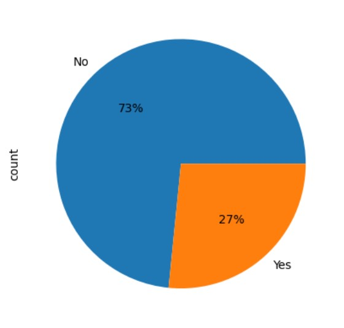
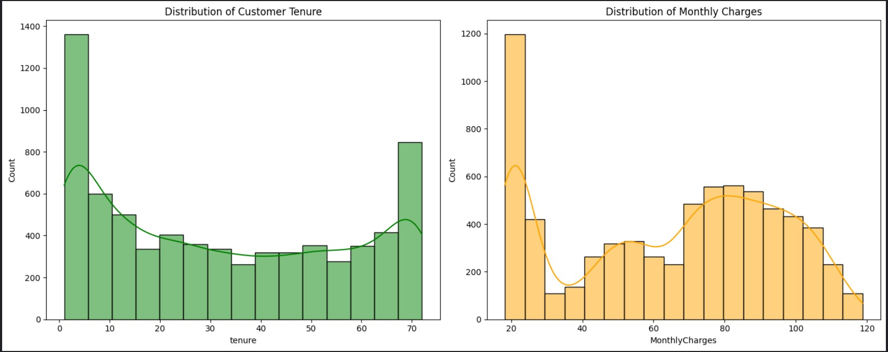
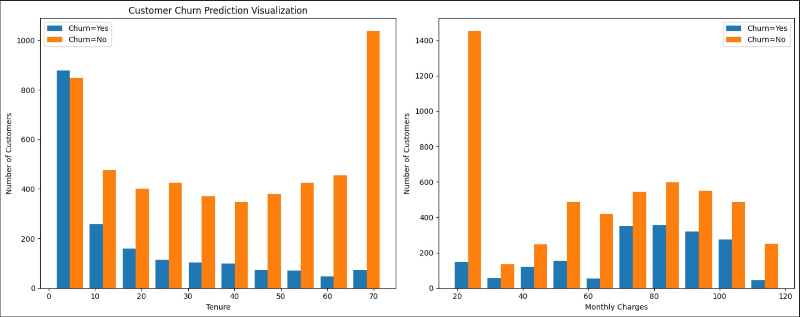
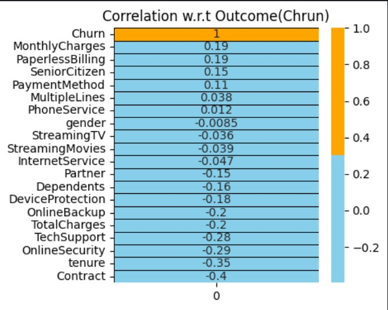
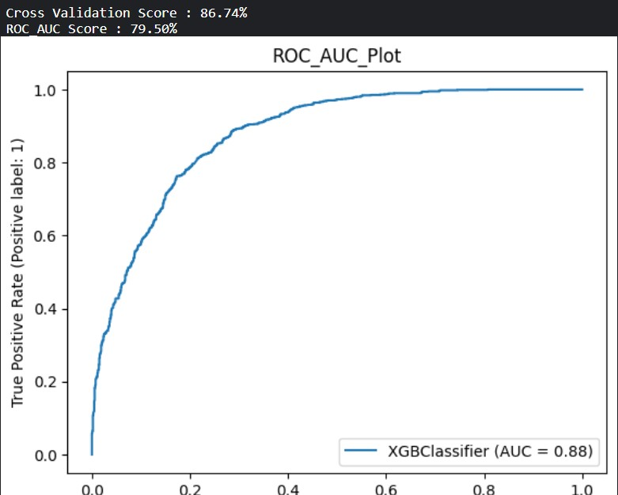
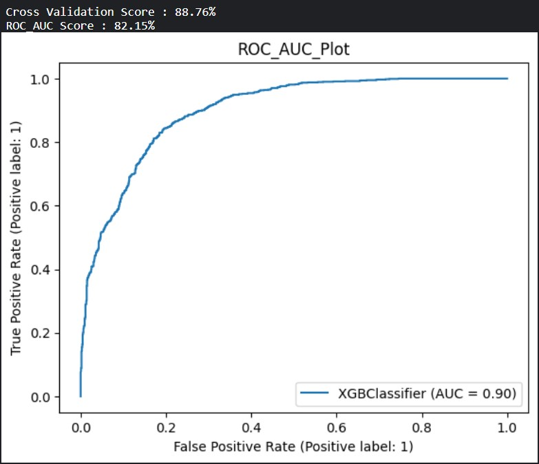

# Telecom Churn Classification
> What is Chrun ?

It is the rate at which customers cease doing business with an entity. Churn is most commonly expressed as the percentage of service subscribers who discontinue their subscriptions within a specified time period.

**Telecom Churn Classification** employs machine learning to predict and categorize customers at risk of discontinuing telecom services. By analyzing historical data and customer interactions, classification models identify patterns indicative of potential churn. This proactive approach allows telecom companies to implement targeted strategies, optimize resources, and enhance customer retention efforts, ultimately fostering long-term loyalty in a competitive market.

## Preprocessing 

- **Data Inspection**: Thorough examination of the dataset to understand its composition and identify the types of data present.

- **Housekeeping Operations**: Removal of redundant columns and irrelevant information to streamline and optimize the dataset. 

- **Handling Missing Data**: Imputation or removal of missing values to ensure data completeness and accuracy.

- **Data Type Assessment**: Evaluation of variable types to address disparities and ensure uniform data type representation.

During the inspection, "TotalCharges" was initially identified as an object due to spaces (" ") in the data, despite being a float. Another interesting finding was that if both "tenure" and "TotalCharges" were zero.

This observation leads to the consideration of a new customer or starting point: If "tenure" is zero, it might mean that the customer is relatively new and has just started using the service. The value of "TotalCharges" being zero could imply that the customer has not incurred any charges yet, perhaps because they are on a free trial or haven't made any purchases.

That's why I have not used mean/median to fill it.

## Exploratory Data Analysis (EDA)

1.**Understand the Dataset**

The dataset is unbalanced ( which is fixed in feature engineering ). 

Begin by obtaining a basic understanding of your dataset.
Here I have chosen to focus on the distribution of **monthly payment** and **tenure** for plotting, as these are the only features with numerical variability (int/float) in contrast to the other features, which predominantly present as binary or categorical options

- **Customer Tenure Distribution** is bi-modal, with peaks at 1-5 months and around 70 months. This indicates a significant turnover of new customers and a strong, loyal customer base, contributing to overall tenure diversity.

- **Monthly Charges Distribution** exhibits wide variability, with a peak around 20, indicating a significant segment with basic, lower-cost services. Another concentration is seen at higher charges (around 70-90), suggesting customers with more comprehensive plans. This diverse distribution reflects the range of pricing options and service plans available to customers.

2.**Univariate Analysis** :  the relationship between a target variable (in this case, churn) and individual features. In univariate analysis, each feature is examined in isolation to understand its distribution and characteristics.
>  ###  Numerical Data 

* Higher churn rates are observed among customers with lower tenure (0-12 months), decreasing significantly as tenure increases, indicating a trend of increased loyalty over time.

* 'Churn vs Monthly Charges' displays a diverse distribution, with a notable peak at lower charges, suggesting a substantial segment of customers preferring basic and lower-cost services.

> ### Binary/Categorical Data
* Omitting "Gender" as it doesn't impact churn rates significantly.

* Fiber optic internet subscribers show higher churn, possibly due to higher expectations or service issues.

* Providing services like tech support reduces churn notably.

* Churn rates vary with payment methods; electronic checks users tend to have higher churn. Consider ordinal encoding based on feature counts.

This is very useful to use because we can consider the number of occurance to define ordinality of the features and use it to do Label Encoding in Feature engineering.

## Feature Engineering

Feature engineering is a crucial phase in the data preprocessing pipeline that involves creating, transforming, or selecting features to enhance the performance of machine learning models.

- ### Data Scaling
In machine learning, models do not inherently comprehend the units associated with feature values. Instead, they interpret inputs as numerical values without grasping their actual significance. To address this limitation and ensure proper model performance, it is essential to scale the data.

Normalization is applied to features with non-normally distributed data, while standardization is performed on features with normally distributed data and varying magnitudes. ***Here I have used normalization to scale it down*** `tenure`, `MonthlyCharge` and `TotalCharges`

- ### Correlation Matrix
A correlation matrix is a fundamental tool in statistical analysis and data exploration, providing a comprehensive view of the relationships between variables within a dataset

It is a huge matrix with too many features. We will check the correlation only with respect to Churn 

In the Churn-specific correlation analysis, numerous features are identified as irrelevant, falling within the range of (-0.1, 0.1). These features can be safely considered for removal, streamlining the dataset for more focused and meaningful analysis.

Using Churn-specific correlation analysis, the features `"MultipleLines," "PhoneService," "gender," "StreamingTV," "StreamingMovies," and "InternetService"` were identified as irrelevant and subsequently removed

- ### Data Balancing using SMOTE
In order to cope with unbalanced data, there are 2 options :

* Undersampling : Trim down the majority samples of the target variable.
* Oversampling : Increase the minority samples of the target variable to the majority samples.

Here, I have performed oversampling due to a small minority class in the dataset, compounded by the overall small size of the dataset

## Modeling 
- I split the data into training (x_train, y_train) and testing (x_test, y_test) sets with an 80:20 ratio.

- I have trained it on 4 models 
    - Logistic Regression
    - Decision Tree
    - Random Forest Classifier
    - XGBoost Classifier

And the thier cross validation score and ROC-AUC are

| Model                    | Cross Validation Score | ROC_AUC Score | recall(macro avg) |
|--------------------------|------------------------|---------------|-------------------|
| Logistic Regression      | 84.94                  | 77.67         | 78                |
| Decision Tree            | 81.60                  | 76.64         | 77                |
| Random Forest Classifier | 84.77                  | 77.89         | 78                |
| XGBoost Classifier       | 86.74                  | 79.50         | 79                |

## Metric
### Recall 
- Critical for minimizing false negatives in customer churn prediction.
- Vital for accurately identifying individuals likely to leave.

### Primary Metric - AUC-ROC
- Widely used and effective for assessing binary classifiers.
- Particularly relevant for imbalanced datasets common in churn prediction.
- Provides comprehensive evaluation of class discrimination.
- Robust in handling imbalanced data, making it a preferred choice.

##### So, XGBoost is the optimal choice due to its highest AUC-ROC, indicating superior ability in distinguishing churn and non-churn cases, coupled with a top-performing Cross Validation Score, affirming its overall effectiveness for precise customer churn prediction in telecommunication.
So, we use grid search to further optimize the parameters of XGBoost.
### Before Grid Search

### After Grid Search

## Conculsion

* To establish a strong customer foundation, the Telco Company should offer affordable entry-level services for the first 6 months, prioritizing OnlineSecurity, OnlineBackup, DeviceProtection, and TechSupport during this critical period. 

* Once a robust support pipeline is established, encourage the use of MultipleLines and Fiber Optic cables for PhoneService and InternetService. Overcome the hurdle of high MonthlyCharges (75+) for these services.

* Make StreamingTV and StreamingMovies affordable to a wider audience, reduce churn tenure, and target a diverse customer base. 

* Simplify the PaymentMethod process, emphasizing Bank Transfer and Credit Card while discontinuing Electronic check due to high churn.

* Customers become cost-conscious at the 70 MonthlyCharges mark, so prioritize service quality as the company's unique selling proposition (USP). Implementing these measures will boost revenue and enhance overall value delivery.

